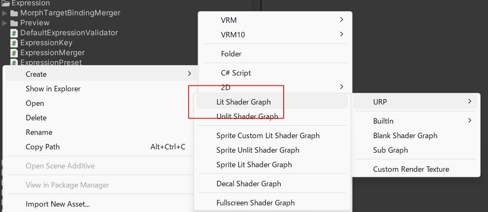
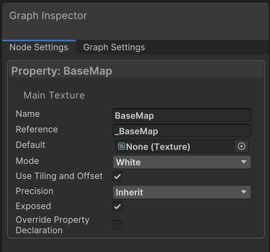

# CustomMaterial の作り方

## ShaderGraph で CustomMaterial を作成

`v0.128.2` [VRM10Viewer Sample](/api/sample/vrm10/VRM10Viewer/) にて PBR と MToon1.0 のカスタムシェーダーを提供予定です。

:::note
応急処置のため Sample に入れて 正式サポート外としております。
:::

PBR はそれなりに、MToon は簡易なものになります。

機能が不足する場合に改造や自作できるように、 UniVRM 向けの `ShaderGraph Shader` 作成と 、作成した Material の `Vrm10Importer への組み込み` を説明します。

```cs
Task<Vrm10Instance> Vrm10.LoadPathAsync(
  string path,
  IMaterialDescriptorGenerator materialGenerator, // この引数を作成します
)
```

## Material 差し替え

- [PBR詳細](./pbr_example)
- [MToon詳細](./mtoon_example)

### ShaderGraph で Shader を作成



`URP - Lit Shader Graph` で作成しました。


#### TextureNode

最低限の動作確認をするために color texture だけを作成ます。

- BaseColor に `Sample Texture 2D` を接続
- `Sample Texture 2D` に `Texture2D Asset` を接続
- `Texture2D Asset` を convert to property
- Name `BaseMap` (CustomMaterialContext.BaseMap と同じ)
- check `Use Tiling and Offsset`
- check `Exposed`



- TextureProperty に MainTexture Flag


### Importer に組込む

<details>
  <summary>CustomMaterialContext.cs</summary>
  <p>

```cs
using System;
using UniGLTF;
using UnityEngine;
using UnityEngine.Rendering;

namespace UniVRM10.VRM10Viewer
{
    public class CustomMaterialContext
    {
        private static readonly int BaseMap = Shader.PropertyToID("_BaseMap");
        public readonly Material Material;

        public Texture BaseTexture
        {
            get => Material.GetTexture(BaseMap);
            set => Material.SetTexture(BaseMap, value);
        }

        public Vector2 BaseTextureOffset
        {
            get => Material.GetTextureOffset(BaseMap);
            set => Material.SetTextureOffset(BaseMap, value);
        }

        public Vector2 BaseTextureScale
        {
            get => Material.GetTextureScale(BaseMap);
            set => Material.SetTextureScale(BaseMap, value);
        }

        public CustomMaterialContext(Material material)
        {
            Material = material;
        }

        public void Validate()
        {
        }
    }
}
```

  </p>
</details>

<details>
  <summary>CustomMaterialDescriptorGenerator.cs</summary>
  <p>

```cs
using System;
using System.Collections.Generic;
using System.Threading.Tasks;
using UniGLTF;
using Unity.IO.LowLevel.Unsafe;
using UnityEngine;

namespace UniVRM10.VRM10Viewer
{
    /// <summary>
    /// GLTF の MaterialImporter
    /// </summary>
    public sealed class CustomMaterialDescriptorGenerator : IMaterialDescriptorGenerator
    {
        public UrpGltfPbrMaterialImporter PbrMaterialImporter { get; } = new();
        public UrpGltfDefaultMaterialImporter DefaultMaterialImporter { get; } = new();

        public Material CustomMaterial { get; set; }

        public CustomMaterialDescriptorGenerator(Material customMaterial)
        {
            CustomMaterial = customMaterial;
        }

        public MaterialDescriptor Get(GltfData data, int i)
        {
            // TODO: VRM

            // UNLIT
            MaterialDescriptor param;
            // if (BuiltInGltfUnlitMaterialImporter.TryCreateParam(data, i, out param)) return param;

            if (TryCreateParam(data, i, out param)) return param;

            // NOTE: Fallback to default material
            if (Symbols.VRM_DEVELOP)
            {
                Debug.LogWarning($"material: {i} out of range. fallback");
            }
            return GetGltfDefault(GltfMaterialImportUtils.ImportMaterialName(i, null));
        }

        public MaterialDescriptor GetGltfDefault(string materialName = null) => DefaultMaterialImporter.CreateParam(materialName);

        public bool TryCreateParam(GltfData data, int i, out MaterialDescriptor matDesc)
        {
            if (i < 0 || i >= data.GLTF.materials.Count)
            {
                matDesc = default;
                return false;
            }

            var src = data.GLTF.materials[i];
            matDesc = new MaterialDescriptor(
                GltfMaterialImportUtils.ImportMaterialName(i, src),
                CustomMaterial.shader,
                null,
                new Dictionary<string, TextureDescriptor>(),
                new Dictionary<string, float>(),
                new Dictionary<string, Color>(),
                new Dictionary<string, Vector4>(),
                new List<Action<Material>>(),
                new[] { (MaterialDescriptor.MaterialGenerateAsyncFunc)AsyncAction }
            );
            return true;

            Task AsyncAction(Material x, GetTextureAsyncFunc y, IAwaitCaller z) => GenerateMaterialAsync(data, src, x, y, z);
        }

        public static async Task GenerateMaterialAsync(GltfData data, glTFMaterial src, Material dst, GetTextureAsyncFunc getTextureAsync, IAwaitCaller awaitCaller)
        {
            var context = new CustomMaterialContext(dst);

            if (src is { pbrMetallicRoughness: { baseColorTexture: { index: >= 0 } } })
            {
                if (GltfPbrTextureImporter.TryBaseColorTexture(data, src, out _, out var desc))
                {
                    context.BaseTexture = await getTextureAsync(desc, awaitCaller);
                    context.BaseTextureOffset = desc.Offset;
                    context.BaseTextureScale = desc.Scale;
                }
            }
        }
    }
}
```

以下の部分が GltfData から ColorTexture を供給します。

```cs
        public static async Task GenerateMaterialAsync(GltfData data, glTFMaterial src, Material dst, GetTextureAsyncFunc getTextureAsync, IAwaitCaller awaitCaller)
        {
            var context = new CustomMaterialContext(dst);

            if (src is { pbrMetallicRoughness: { baseColorTexture: { index: >= 0 } } })
            {
                if (GltfPbrTextureImporter.TryBaseColorTexture(data, src, out _, out var desc))
                {
                    context.BaseTexture = await getTextureAsync(desc, awaitCaller);
                    context.BaseTextureOffset = desc.Offset;
                    context.BaseTextureScale = desc.Scale;
                }
            }
        }
```

  </p>
</details>

## IMaterialDescriptorGenerator 詳細

TODO:
