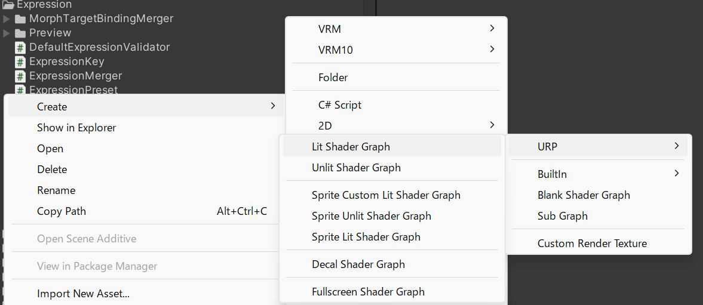
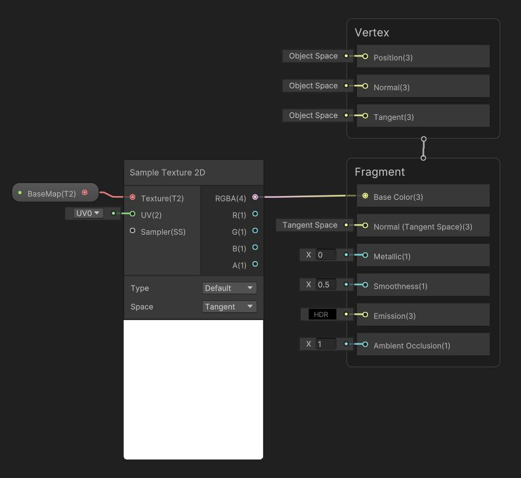
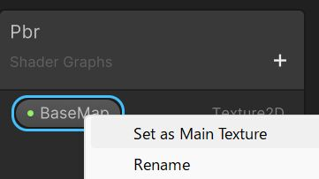

# CustomMaterial の作り方

## WebGL + RuntimeLoad 問題

WebGL で RuntimeLoad する場合に Unity の ShaderVariant の解決がうまくいかないようです。

https://github.com/vrm-c/UniVRM/issues/2548

## URP/Lit を Always Included Shaders にできない問題

`Universal Render Pipeline/Lit` は ShaderVariant が厖大で、 `Always Included Shaders` に登録することが非推奨です。

https://github.com/vrm-c/UniVRM/pull/2498

https://discussions.unity.com/t/urp-lit-sample-is-missing-all-shaders-in-webgl-build/863894/4

RuntimeLoad 向けではありません。

## ShaderGraph で CustomMaterial を作成

`v0.128.2` [VRM10Viewer Sample](/api/sample/vrm10/VRM10Viewer/) にて PBR と MToon1.0 のカスタムシェーダーを提供予定です。

応急処置のため Sample に入れて 正式サポート外としております。
PBR はそれなりに、MToon は簡易なものになります。

機能が不足する場合に改造や自作できるように、 `ShaderGraph Shader` 作成と `Vrm10Importer へのカスタムの MaterialLoader 組み込み` を説明します。

| shader        | desktop urp                               | webgl urp                  | note                           |
| ------------- | ----------------------------------------- | -------------------------- | ------------------------------ |
| URP PBR       | VRM10Viewer の CustomPBR                  | VRM10Viewer の CustomPBR   | Always Included Shaders 問題   |
| URP unlit     | `UniGLTF/UniUnlit`                        | `UniGLTF/UniUnlit`         |                                |
| URP MToon-1.0 | `VRM10/Universal Render Pipeline/MToon10` | VRM10Viewer の CustomMtoon | WebGL runtimeload variant 問題 |

## 手順

### Shader 関連の命名ガイドライン

シェーダーを中心に複数の関連ファイルを管理するので、一貫した命名にすると便利です。

TinyPbr と名付けた例。

| type                         | name                          | note                                                               |
| ---------------------------- | ----------------------------- | ------------------------------------------------------------------ |
| shader                       | TinyPbr                       | TinyPbrOpaque, TinyPbrAlphaBlend, TinyPbrCutoff が必要かもしれない |
| 補助クラス                   | TinyPbrMaterialContext.cs             |                                                                    |
| IMaterialDescriptorGenerator | TinyPbrMaterialDescriptorGenerator.cs |                                                                    |

### ShaderGraph で Shader を作成



`URP - Lit Shader Graph` で作成しました。



#### TextureNode

最低限の動作確認をするために color texture だけを作成ます。

- BaseColor に `Sample Texture 2D` を接続
- `Sample Texture 2D` に `Texture2D Asset` を接続
- `Texture2D Asset` を convert to property
- Name `BaseMap` (TinyPbrMaterialContext.BaseMap と同じ)
- check `Use Tiling and Offsset`
- check `Exposed`


- TextureProperty に MainTexture Flag



### Importer に組込む

<details>
  <summary>TinyPbrMaterialContext.cs</summary>
  <p>

```cs
using UnityEngine;

namespace UniVRM10.VRM10Viewer
{
    public class TinyPbrMaterialContext
    {
        private static readonly int BaseMap = Shader.PropertyToID("_BaseMap");
        public readonly Material Material;

        public Texture BaseTexture
        {
            get => Material.GetTexture(BaseMap);
            set => Material.SetTexture(BaseMap, value);
        }

        public Vector2 BaseTextureOffset
        {
            get => Material.GetTextureOffset(BaseMap);
            set => Material.SetTextureOffset(BaseMap, value);
        }

        public Vector2 BaseTextureScale
        {
            get => Material.GetTextureScale(BaseMap);
            set => Material.SetTextureScale(BaseMap, value);
        }

        public TinyPbrMaterialContext(Material material)
        {
            Material = material;
        }
    }
}
```

  </p>
</details>

<details>
  <summary>TinyPbrMaterialDescriptorGenerator.cs</summary>
  <p>

```cs
using System;
using System.Collections.Generic;
using System.Threading.Tasks;
using UniGLTF;
using UnityEngine;

namespace UniVRM10.VRM10Viewer
{
    /// <summary>
    /// GLTF の MaterialImporter
    /// </summary>
    public sealed class TinyPbrMaterialDescriptorGenerator : IMaterialDescriptorGenerator
    {
        public UrpGltfPbrMaterialImporter PbrMaterialImporter { get; } = new();
        public UrpGltfDefaultMaterialImporter DefaultMaterialImporter { get; } = new();

        public Material Material { get; set; }

        public TinyPbrMaterialDescriptorGenerator(Material material)
        {
            Material = material;
        }

        public MaterialDescriptor Get(GltfData data, int i)
        {
            // TODO: VRM

            // UNLIT
            MaterialDescriptor param;
            // if (BuiltInGltfUnlitMaterialImporter.TryCreateParam(data, i, out param)) return param;

            if (TryCreateParam(data, i, out param)) return param;

            // NOTE: Fallback to default material
            if (Symbols.VRM_DEVELOP)
            {
                Debug.LogWarning($"material: {i} out of range. fallback");
            }
            return GetGltfDefault(GltfMaterialImportUtils.ImportMaterialName(i, null));
        }

        public MaterialDescriptor GetGltfDefault(string materialName = null) => DefaultMaterialImporter.CreateParam(materialName);

        public bool TryCreateParam(GltfData data, int i, out MaterialDescriptor matDesc)
        {
            if (i < 0 || i >= data.GLTF.materials.Count)
            {
                matDesc = default;
                return false;
            }

            var src = data.GLTF.materials[i];
            matDesc = new MaterialDescriptor(
                GltfMaterialImportUtils.ImportMaterialName(i, src),
                Material.shader,
                null,
                new Dictionary<string, TextureDescriptor>(),
                new Dictionary<string, float>(),
                new Dictionary<string, Color>(),
                new Dictionary<string, Vector4>(),
                new List<Action<Material>>(),
                new[] { (MaterialDescriptor.MaterialGenerateAsyncFunc)AsyncAction }
            );
            return true;

            Task AsyncAction(Material x, GetTextureAsyncFunc y, IAwaitCaller z) => GenerateMaterialAsync(data, src, x, y, z);
        }

        public static async Task GenerateMaterialAsync(GltfData data, glTFMaterial src, Material dst, GetTextureAsyncFunc getTextureAsync, IAwaitCaller awaitCaller)
        {
            var context = new TinyPbrMaterialContext(dst);

            if (src is { pbrMetallicRoughness: { baseColorTexture: { index: >= 0 } } })
            {
                if (GltfPbrTextureImporter.TryBaseColorTexture(data, src, out _, out var desc))
                {
                    context.BaseTexture = await getTextureAsync(desc, awaitCaller);
                    context.BaseTextureOffset = desc.Offset;
                    context.BaseTextureScale = desc.Scale;
                }
            }
        }
    }
}
```

以下の部分が GltfData から ColorTexture を供給します。

```cs
        public static async Task GenerateMaterialAsync(GltfData data, glTFMaterial src, Material dst, GetTextureAsyncFunc getTextureAsync, IAwaitCaller awaitCaller)
        {
            var context = new TinyPbrMaterialContext(dst);

            if (src is { pbrMetallicRoughness: { baseColorTexture: { index: >= 0 } } })
            {
                if (GltfPbrTextureImporter.TryBaseColorTexture(data, src, out _, out var desc))
                {
                    context.BaseTexture = await getTextureAsync(desc, awaitCaller);
                    context.BaseTextureOffset = desc.Offset;
                    context.BaseTextureScale = desc.Scale;
                }
            }
        }
```

  </p>
</details>

## IMaterialDescriptorGenerator 詳細

### マテリアルを分岐させる

unlit, gltf を分岐させます。
両方を作ることができなかった場合は `glTF default pbr` を作成します。

```cs
        public MaterialDescriptor Get(GltfData data, int i)
        {
            // UNLIT を試す
            if (BuiltInGltfUnlitMaterialImporter.TryCreateParam(data, i, out var param)) return param;
            // PBR を試す
            if (PbrMaterialImporter.TryCreateParam(data, i, out param)) return param;

            // NOTE: Fallback to default material
            if (Symbols.VRM_DEVELOP)
            {
                UniGLTFLogger.Warning($"material: {i} out of range. fallback");
            }
            return GetGltfDefault(GltfMaterialImportUtils.ImportMaterialName(i, null));
        }
```

## PBR 詳細

### BaseColor
### MetallicRoughness & Occulusion
### Normal
### Emission
### Doubleface
### Opaque / AlphaBlending / Cutoff

## MToon 詳細

TODO:
